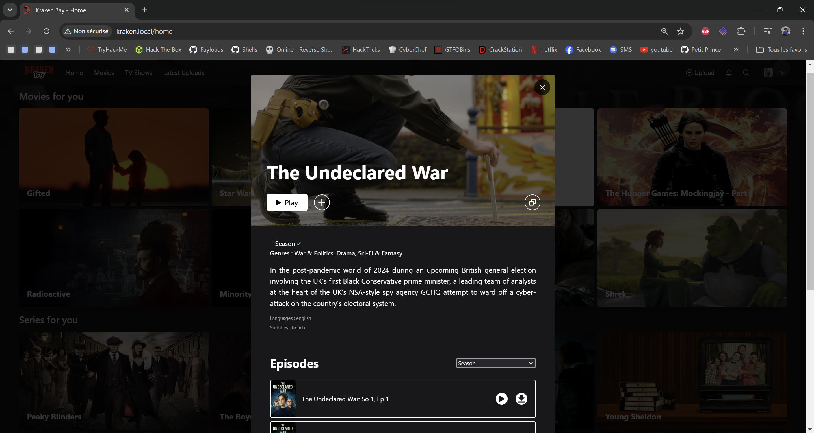
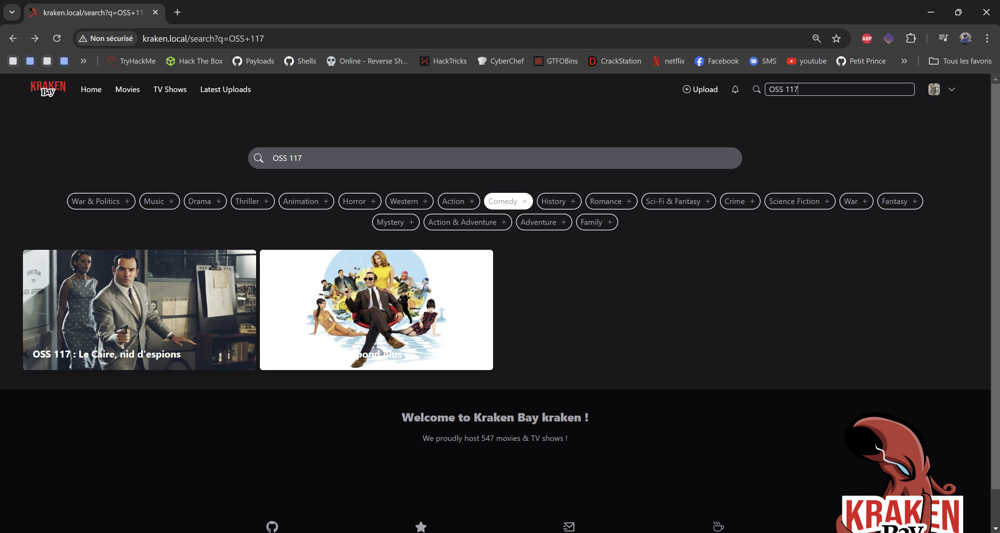
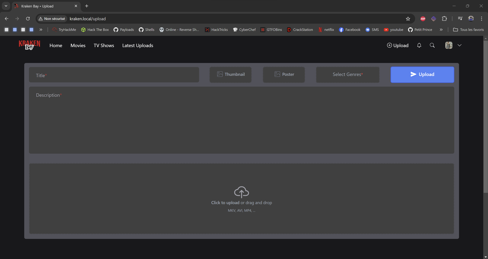
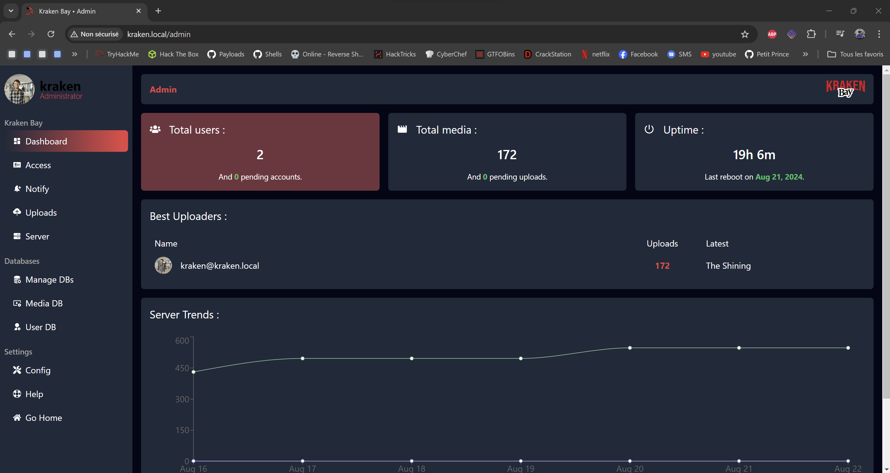
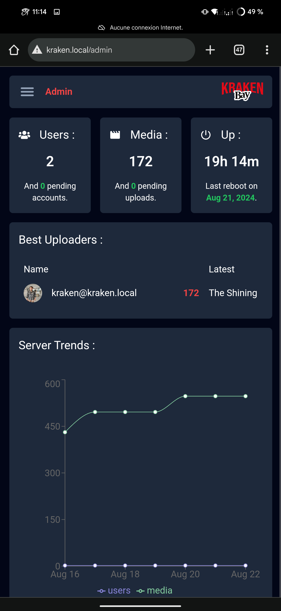
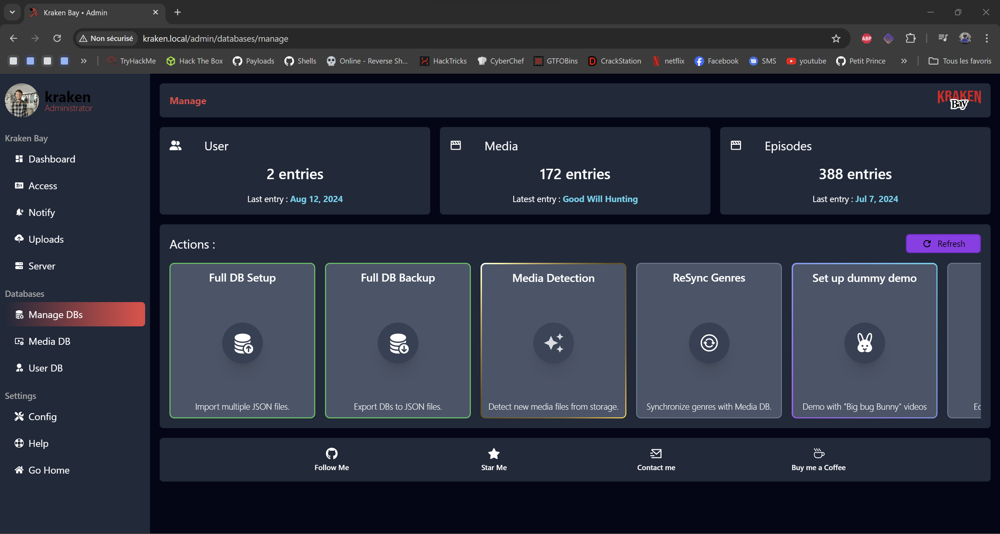

# Kraken Bay

Open source Media Center and Netflix-like server.
Tested on Ubuntu 24.04

!(KrakenBay)[Images/GitHubDemo.gif]

Icludes :
- Main web server on port 80 (Netflix like interface)
- File server to provide Assets on port 8080 (dockerized)
- MySQL server to handle main web server (dockerized)
- Two samba shares to provide a streaming service integrated in VLC
- "Hotspot mode" to turn you server in a hotspot
- ...

## Setup

Install pip requirements (as root) :

> sudo pip install -r requirements.txt --break-system-packages

Run setup.py (as root) :

> sudo python setup.py

Open your browser and navigate to http://kraken.local/auth and login with the credentials defined in setup.py !

> You have the possibility to edit the basic variables such as :
> - Username
> - Password
> - Hostname
> - Database
> - File path (where the Assets are stored (Movies, TV SHows etc.))
> - Port for the file server
>
> Keep in mind that the setup and features were tested with the default values and changing them may break some features.

## Features :

Fully functional and reactive web server with Netflix inspired UI, including :

| Desktop | Mobile |
| :-: | :-: |
|  |  |
|  |  |
|  |  |
|  |  |
|  |  |
|  |  |
|  |  |
|  |  |

A dedicated protected admin environment :

| Desktop | Mobile |
| :-: | :-: |
|  |  |
|  |  |
|  |  |

And many more !!

## Known issues :

- Reduce user image upload size
- Close infomodal upon certain actions

## Collaborate

Feel free to get in touch to share your ideas :
- Discord : PetitPrince#1380

## Support

> 👋🏼 Hey everyone ! I provide free software, feel free to use it and edit it as you wish. I will also provide a bit of support should you need it when contacted through the contact channels specified below. Feel free to help me out as you can !

- ⭐️ You can help by hitting Star on the repositories you like !
- ☕️ You can buy me a [coffee](https://www.paypal.com/paypalme/AReppelin)
- ✨ Contributions of any kind are welcome!

